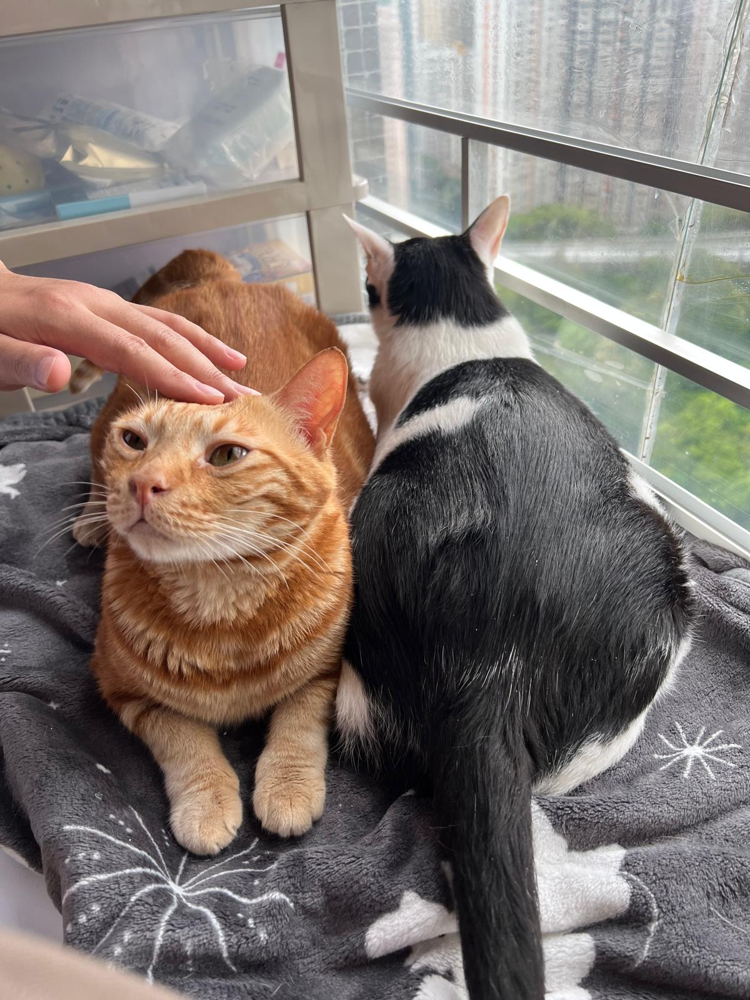
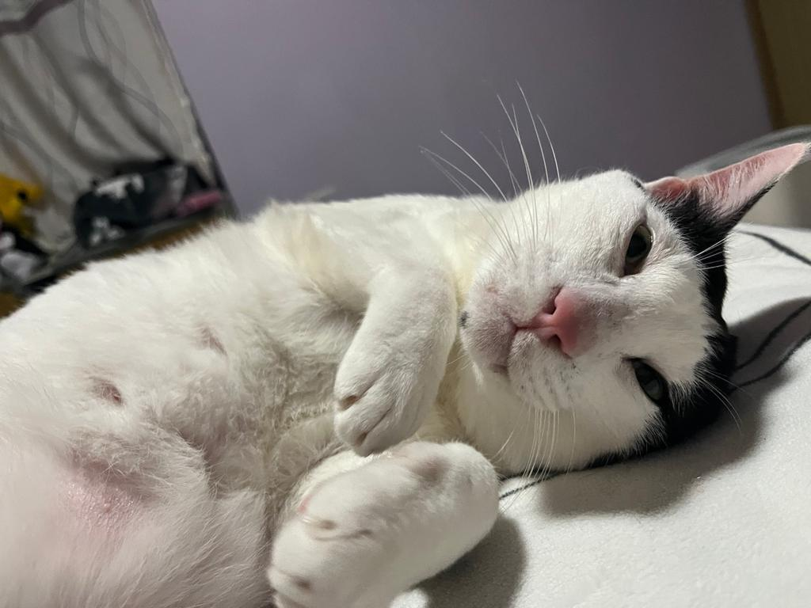
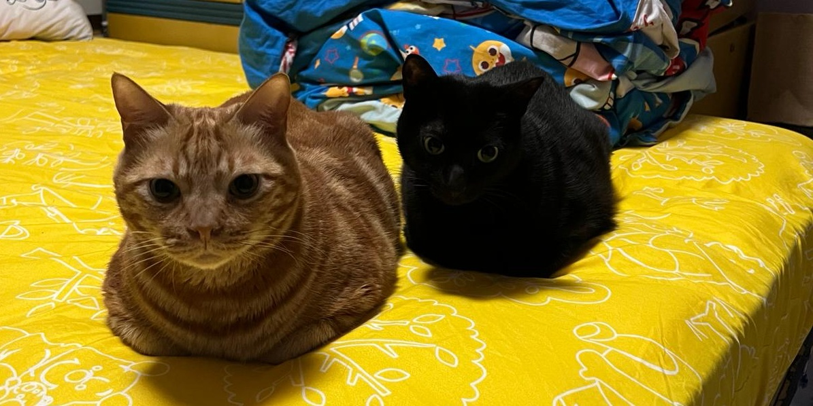
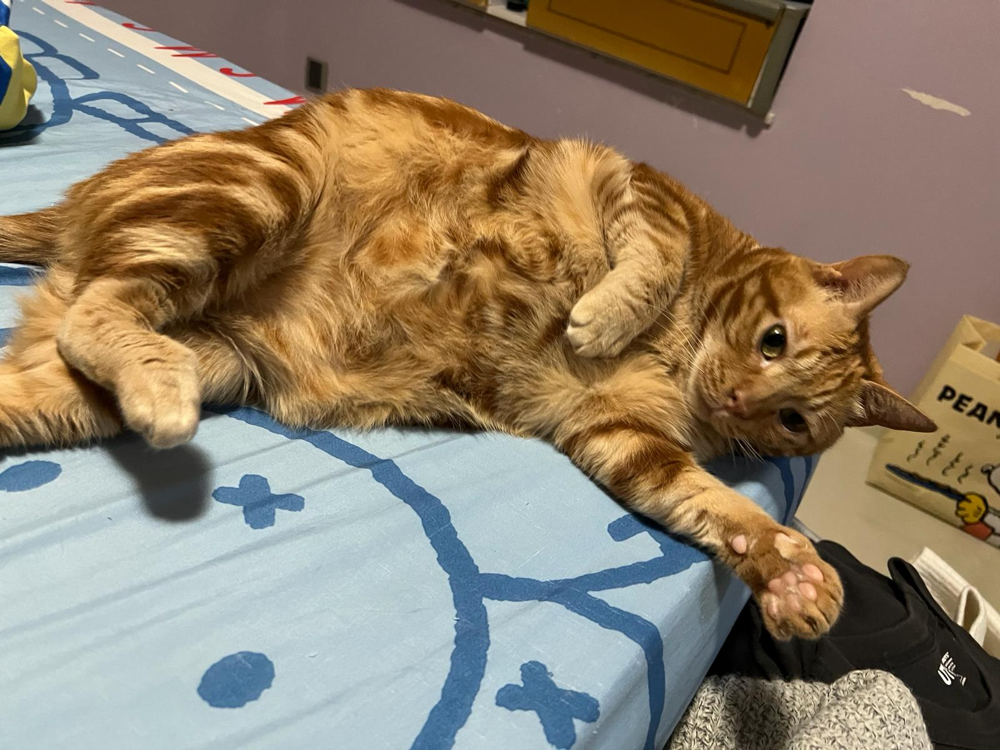
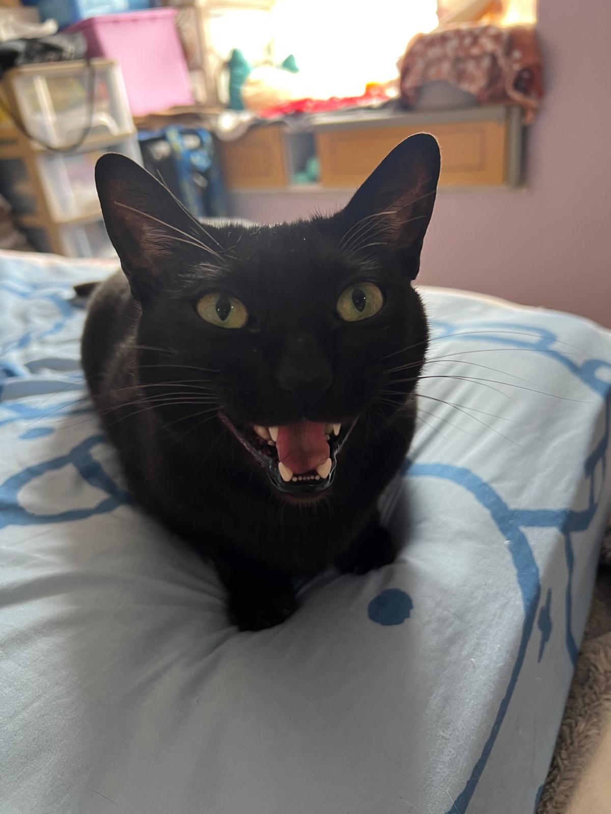

## Say Hello to everyone!

Hello everyone! I'm Marco, a passionate Cloud DevOps Engineer from Hong Kong and a proud cat person. As a dedicated cat person, my three adorable companions, BB, Chacha and Makmak, bring me endless joy and comfort. They make every return home a moment of pure happiness for me.

In addition to my love for cloud technology, I'm also a squash player currently looking for a squash club to join. It's a great way for me to stay active and unwind outside of work.



<!-- 
  
  
  
  
  

> -->

## What I do

In my role as a Cloud Engineer, I am deeply engaged in crafting robust cloud architectures and implementing efficient DevOps practices. My journey in Cloud Engineering is driven by a passion for leveraging technology to optimize business operations and drive growth. Under the mentorship of Jam at Green Tomato, I've honed my expertise in designing scalable cloud solutions that align with strategic business objectives. Effective collaboration and communication with cross-functional teams are integral to my approach, ensuring seamless deployment and management of cloud infrastructures. I am dedicated to continuous learning and innovation, staying abreast of industry trends to deliver cutting-edge solutions that meet evolving business needs.

## Learn to be a better ITer

Recently, I earned the Azure Administrator Associate certification (AZ-104), showing my skills in managing Azure environments. Looking ahead, I'm eager to pursue certifications in Certified Kubernetes Administrator and either Azure or AWS professional solution architect for my next steps, aiming to broaden my skill set and stay at the forefront of industry trends.

## Target

As I continue to grow in my career, I am excited about the opportunity to contribute my skills in cloud architecture, DevOps practices, and continuous improvement to a new team. I believe in the transformative potential of cloud technologies and am committed to delivering solutions that drive business growth and innovation.

Join me on this journey as we explore the ever-evolving landscape of Cloud Engineering together!