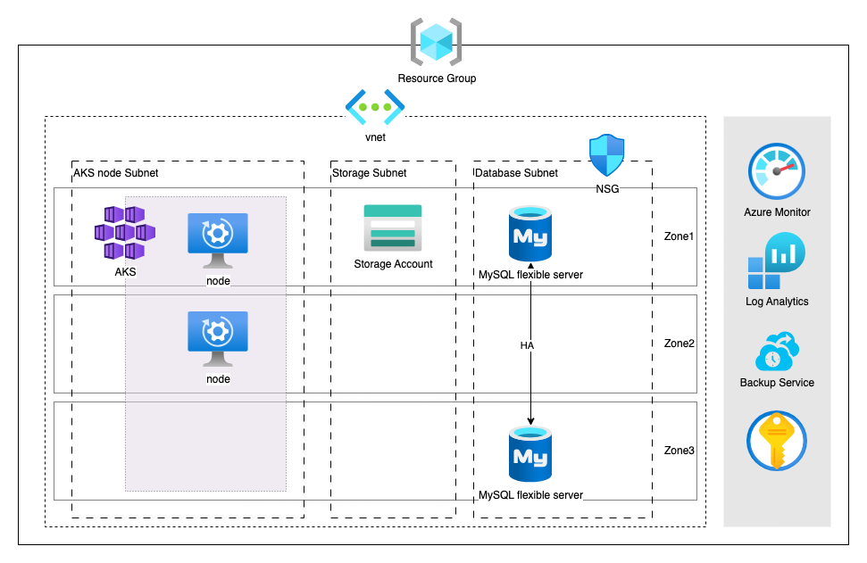

## Introduction

Hello everyone! In this article, I will show you how to provision cloud resources for a 3-tier architecture through IaC by Terraform and deploy the application in Kubernetes(AKS).

Terraform as a cornerstone in IaC, revolutionizes modern IT practices, offering unparalleled benefits for reliability and agility. Notably, Terraform sets itself apart by being cloud-agnostic, allowing for the seamless integration of multiple providers and services, and creating a comprehensive representation and management of the entire infrastructure ecosystem and its associated services.

With my experience in cloud architecture, I will demonstrate and explain all processes from provisioning cloud infrastructure to application deployment. Assuming our customer has DevOps Team to handle operational workloads and will deploy monitoring tools to observe the performance of their applications, we deploy Kubernetes service instead of container service, to provide more control and flexibility.

In this blog, we will first go through all the steps on how we provision cloud infrastructure in Azure by Terraform with well-designed cloud strategy, from considering aspects of security, data protection, monitoring, etc. So, let's get started!

For more information on Terraform, please refer to [Terraform](https://developer.hashicorp.com/terraform) and [Azure Provider](https://registry.terraform.io/providers/hashicorp/azurerm/latest/docs) for information and documents.

## Architecture



## Before you begin

To complete this document you need the following resources:

- Azure Account
- Azure Service Principal

To create Azure Account and Service Principal, please refer to [Azure Account](https://azure.microsoft.com/en-us/free) and [Azure Service Principal](https://learn.microsoft.com/en-us/training/modules/authenticate-azure-deployment-pipeline-service-principals/3-create-service-principal-key?pivots=cli).

>Note: The whole demonstration will run in bash, Azzure CLI, and TF code for further CICD.

## Set up TF project

### Terraform State

The first step in Terraform is to set up the location of the state file.

Terraform creates a state file called “terraform.tfstate.” This file tracks the current state of your infrastructure and resources, enabling Terraform to manage and update them as needed.

By default, the state file is saved locally inside the Terraform project directory, making it accessible only to the individual working on the project.

<!-- <figure style="  display: block; margin: 0 auto 0.55em;">
  
  <figcaption style="color: #F5F4F3; font-style: italic; font-size:80%;">Example - tfstate in local directory</figcaption>
</figure> -->



### Management on Terraform State

According to AWS, the recommended practice for managing state files is to use Terraform's built-in support for remote backends.

In a development project where multiple people need to access the state file, it should be kept in a durable and scalable environment. A shared storage system effectively meets these requirements.

For our demonstration, we have chosen **Azure Blob Storage** as the backend for Terraform.


Azure Blob Storage provides server-side encryption to protect your data, preventing unauthorized access and safeguarding sensitive information.


### Create Azure Blob Storage

Before you create blob storage, sign in with Azure CLI.

```
APPID="<app-id>"
SPPASSWORD="<password-or-cert>"
SPTENANT="<tenant>"

# Login with service-principal
az login --service-principal -u $APPID -p $SPPASSWORD --tenant $SPTENANT
```

Then, run Azure CLI to create resource group, storage account and blob container for storing tf state.

```
#!/bin/bash

RESOURCE_GROUP_NAME="project-tfstate"
STORAGE_ACCOUNT_NAME="project-tfstate-sa"
CONTAINER_NAME="project-tfstate-sa-blob"
PUBLIC_IP="16.17.18.0/24" ##Example

# Create resource group
az group create --name $RESOURCE_GROUP_NAME --location eastus

```

We create storage account with enabled **Infrastructure encryption** as 1st-layer encryption.

Moreover, we **block public network access** and add a network rule to only **allow configuring access from our on-premises network**.

```
# Create storage account
az storage account create 
    --resource-group $RESOURCE_GROUP_NAME\
    --name $STORAGE_ACCOUNT_NAME --sku Standard_LRS\
    --encryption-services blob\
    --kind StorageV2 --allow-blob-public-access false\
    --require-infrastructure-encryption

# Add a network rule for an IP address range to Storage Account
az storage account network-rule add 
    --resource-group $RESOURCE_GROUP_NAME\
    --account-name $STORAGE_ACCOUNT_NAME --ip-address $PUBLIC_IP

# Create blob container
az storage container create 
    --name $CONTAINER_NAME\
    --account-name $STORAGE_ACCOUNT_NAME
```


Infrastructure encryption can be enabled for the entire storage account, or for an encryption scope within an account.


>

Detail for Storage Account will be explained in section for storage.


### Create Terraform State

We define backend in configuration to create Azure Blob Storage backend.

> Note: We use the name of Storage Account, resource group, and blob storage created in the pervious step as variables in those configurations.

```
# provider.tf

terraform {
  backend "azurerm" {
    resource_group_name  = "project-tfstate"
    storage_account_name = "project-tfstate-sa"
    container_name       = "project-tfstate-sa-blob"
    key                  = "demo.terraform.tfstate"
  }
}

```


### Provider Configuration

Terraform relies on plugins called providers to interact with cloud providers, SaaS providers, and other APIs. Thus, we add provider ***"azurerm"*** for Terraform to interact with Azure.


Specify the version on provider as for provider versioning, and avoid accidental upgrades to incompatible new versions.


```
# provider.tf

terraform {
  required_providers {
    azurerm = {
      source  = "hashicorp/azurerm"
      version = "=3.79.0"
    }
  }
  backend "azurerm" {
    ....
  }
}

# Configure the Azure provider
provider "azurerm" {
  features {
    key_vault {
      purge_soft_delete_on_destroy    = true
      recover_soft_deleted_key_vaults = true
    }
  }
  storage_use_azuread        = true
  skip_provider_registration = true
}
```

### Terraform Basic CLI

While writing terraform code, we have a basic workflow to provision resources. Furthermore, we can also run the workflow for script testing to make sure resources can be deployed. Refer to [tutorial from Terraform](https://developer.hashicorp.com/terraform/tutorials/cli/init), 3 core steps should be run to deploy your Terraform code:

- ***Initialize*** prepares your workspace so Terraform can apply your configuration.
- ***Plan*** allows you to preview the changes Terraform will make before you apply them.
- ***Apply*** makes the changes defined by your plan to create, update, or destroy resources.

>Note: Details of command options can refer to [Terraform command document](https://developer.hashicorp.com/terraform/cli/run).

#### Initialize

Initialize the Terraform configuration to install the required providers. Whenever you add a new provider or module to your configuration or tests, you must run the `terraform init` command.

Example with options:
```
# Don't hold a state lock during backend migration.
terraform init -lock=false 

# Reconfigure a backend, and attempt to migrate any existing state.
terraform init -migrate-state 

# Reconfigure a backend, ignoring any saved configuration.
terraform -reconfigure 

# Configuration to be merged with what is in the configuration file's 'backend' block. 
terraform -backend-config=path 
```

#### Plan

When you run the `terraform plan` command, Terraform generates a plan by comparing your current configuration to the existing state of your infrastructure. The plan categorizes changes into three types: create, update, or destroy resources. Here are some examples with options:

```
# Load variable values from the specified file.
terraform plan -var-file=filename 

# Set a value for an input variable in the root module of the configuration.
terraform plan -var 'foo=bar'

# Create a plan to destroy all objects currently managed by this Terraform configuration.
terraform plan -destroy 

# Check whether remote objects still match the most recent Terraform apply, without proposing any actions to undo changes made outside of Terraform.
terraform plan -refresh-only

# Write the generated plan to the specified file in an opaque format, which can later be passed to 'terraform apply' to execute the planned changes.
terraform plan -out=FILENAME
```

Developers can use the terraform plan command to preview the results and impact of code changes. Furthermore, the ***'-out'*** flag is commonly used in CI/CD processes. It ensures consistent results when separating the "plan" and "apply" stages in deployment. It is recommended to name the plan file ***"tfplan"***.


Be cautious with the ***'destroy'*** type, as cloud resources will be destroyed once you run the ***'apply'*** command.


#### Apply

The `terraform apply` command assesses the current infrastructure state, identifies discrepancies, and adjusts resources by creating, updating, or deleting them as needed. 

Typically, when this command is run without any options, Terraform will execute a terraform plan, present the user with the proposed changes or impacts, and then prompt for confirmation before proceeding with the execution.

Example with options:
```
# Load variable values from the specified file.
terraform apply -var-file=filename 

# Set a value for an input variable in the root module of the configuration.
terraform apply -var 'foo=bar'

# Destroy all objects currently managed by this Terraform configuration.
terraform apply -destroy

# Automatically applies all changes and impacts without prompting you for confirmation.
terraform apply -auto-approve 

# takes the actions in the saved plan without prompting you for confirmation.
terraform apply [plan file]

# Apply changes only on targeted resource
terraform apply -target=”module.vnet.0"
```

For a two-step workflow in CI/CD, you can use either the ***'-auto-approve'*** flag or pass a previously saved plan file. However, note that the ***'-auto-approve'*** flag will be ignored when a plan file is passed because Terraform treats the plan file as the approval and will not prompt for confirmation in that case.


Be cautious with the ***'destroy'*** type, as cloud resources will be destroyed once you run the ***'apply'*** command.
