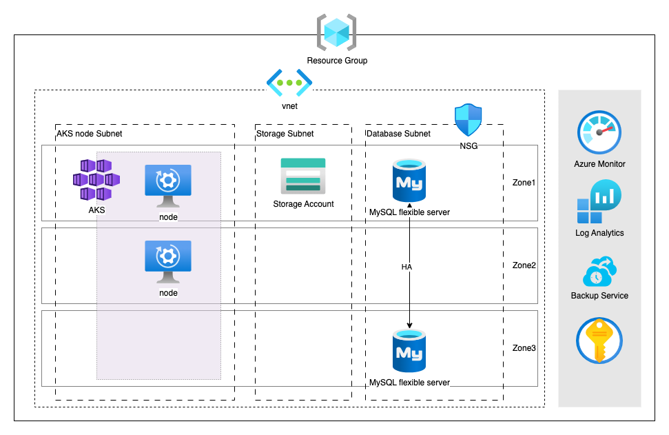
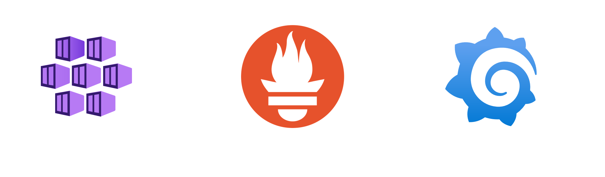

## Architecture



## Creating Cloud Resource with Terraform

### Kubernetes Cluster

As a hosted Kubernetes service, Azure handles critical tasks, like health monitoring and maintenance. AKS will automatically create a node resource group, that contains all of the infrastructure resources associated with the cluster, named `"MC_${resource_group}_${AKS_name}_${region}"`. 

Kubenet was chosen as networking option(CNI) in my experience, as we didn't have enough information to design networking at the initial stage when we were working on project. I advise choosing Azure CNI for better solutions, also better performance, and adding transparency to network.

>Note: Please refer to [AKS: Kubenet vs Azure CNI](https://mehighlow.medium.com/aks-kubenet-vs-azure-cni-363298dd53bf) to learn more about the difference between Kubenet and Azure CNI.

>Note: AKS has a high Log Analytics cost, including Container Insights, Prometheus, and Grafana. Determine if feature should be enabled or not by considering project budget. Learn [more](https://learn.microsoft.com/en-us/azure/azure-monitor/containers/kubernetes-monitoring-enable?tabs=terraform) to enable these monitoring features.

```
# aks.tf
# AKS
resource "azurerm_kubernetes_cluster" "main" {
  name                = "project-aks-${var.environment}"
  location            = azurerm_resource_group.project.location
  resource_group_name = azurerm_resource_group.project.name
  dns_prefix          = "project-k8s-${var.environment}"

  # For production change to "Standard"
  sku_tier = "Free"   # Can also be set to Standard

  # latest recommended version will be used if kubernetes_version isn't specified 
  # kubernetes_version = 1.29

  network_profile {
    network_plugin = "azure" # choosing Azure CNI as networking option(CNI)
    network_policy  = "azure" # currently use Azure Network Policy Manager, possible values are calico, azure and cilium
    dns_service_ip = "10.0.2.10"
    service_cidr   = "10.0.2.0/24"
  }

  default_node_pool {
    name                = "default"
    vm_size             = "Standard_D2_v5" # 2 CPU, 8 GiB, On Demand $0.1320USD for Region East Asia
    vnet_subnet_id      = azurerm_subnet.node_subnet.id # use created node subnet
    type                = "VirtualMachineScaleSets" # use "VirtualMachineScaleSets" in order to enable auto-scaling
    enable_auto_scaling = true
    node_count          = 1
    min_count           = 1
    max_count           = 2

    # Kubernetes labels for nodes
    node_labels = { 
      env = "test"
    }
  }

  identity {
    type         = "UserAssigned"
    identity_ids = [azurerm_user_assigned_identity.uai.id] # use created UAI as Service Identity
  }

  # Enable Container insights for real time pod logging
  oms_agent {
    log_analytics_workspace_id = azurerm_log_analytics_workspace.aks_insights.id
  }

  tags = {
    Environment = "${var.environment}"
  }
}

＃ create output to config AKS in Terraform's provider if needed

# output "client_certificate" {
#   value = azurerm_kubernetes_cluster.main.kube_config.0.client_certificate
# 
#   sensitive = true
# }
# 
# output "kube_config" {
#   value = azurerm_kubernetes_cluster.main.kube_config_raw
# 
#   sensitive = true
# }
```

#### Azure Container Registry

We then create Azure Container Registry to build, store, and manage container images.

```
# Container Registry
resource "azurerm_container_registry" "project" {
  name                = "projectRegistry${var.environment}"
  resource_group_name = azurerm_resource_group.project.name
  location            = azurerm_resource_group.project.location
  sku                 = "Basic" # use basic tier as we dont need large storage to store image
}

# Attaching ACR to AKS

# Role Assignment for AKS
resource "azurerm_role_assignment" "project_role" {
  principal_id                     = azurerm_kubernetes_cluster.main.kubelet_identity[0].object_id
  role_definition_name             = "AcrPull"
  scope                            = azurerm_container_registry.project.id
  skip_service_principal_aad_check = true
}
```

#### Monitoring for AKS



For monitoring AKS, Prometheus and Grafana are go-to tools. Prometheus collects detailed metrics directly from the cluster, while Grafana makes it easy to visualize and analyze those metrics with customizable dashboards. Together, they help you spot trends, optimize performance, and troubleshoot problems effectively.

Considering our use case has a cost limit and is primarily for demonstration purposes, I opted for a self-hosted Prometheus and Grafana setup. While Container Insights—which integrates seamlessly with Azure Monitor—provides a robust built-in monitoring option, Prometheus offers greater flexibility. It allows access to similar metrics while enabling customization and easier integration with other open-source tools. This flexibility makes Prometheus a preferred choice for scenarios requiring tailored monitoring solutions. For detailed instructions, please refer to the following guideline : [Monitoring AKS With Prometheus and Grafana](https://dev.to/thenjdevopsguy/monitoring-aks-with-prometheus-and-grafana-9o8).

>Note: Azure also offers managed Prometheus and Grafana services as an alternative to self-hosting. Self-hosting slightly costs since it requires more AKS nodes, while Azure’s managed services deploy two compute nodes for Grafana and more custom cost for managed Prometheus, which comes at a higher price. However, for smaller teams looking to save on maintenance effort, the managed option might be the better choice. It’s all about finding the right balance between budget and team capacity.

### Budget 

Creating budget to monitor all of Azure service charges and track your actual Azure service costs.

#### Action Group

Action groups can perform various actions when your budget threshold is met. We can also enable mobile push notifications by enabling Azure app push notifications while configuring the action group. But here we use email as a demo.

```
# budget.tf
# Action Group for Contact
resource "azurerm_monitor_action_group" "project_subscription" {
  name                = "project_subscription_monitoring_${var.environment}"
  resource_group_name = azurerm_resource_group.project.name
  short_name          = "project"

  email_receiver {
    name          = "sendtoadmin"
    email_address = "marcotam.work@gmail.com"
    use_common_alert_schema = true
  }

  email_receiver {
    name                    = "sendtodevops"
    email_address           = "mymanager@gmail.com"
    use_common_alert_schema = true
  }
}
```

#### Budget

For budget, we use 2 resource groups as budget scope, with a budget amount of USD 1000. Different contact options are shown in code below.

```
# budget.tf
# Budget
resource "azurerm_consumption_budget_subscription" "project_subscription" {
  name            = "project_subscription_budget-${var.environment}"
  subscription_id = data.azurerm_subscription.current.id

  amount     = 1000 # setting USD$1000 for total
  time_grain = "Monthly"

  time_period {
    start_date = formatdate("YYYY-MM-01'T'00:00:00Z", timestamp()) # take current date as start date
  }

  filter {
    dimension {
      name = "ResourceGroupName"
      values = [
        azurerm_resource_group.project.name, "MC_project-${var.environment}_project-aks-${var.environment}_eastasia" # initial resource group and AKS resource group
      ]
    }
  }

  notification {
    enabled   = true
    threshold = 70.0
    operator  = "EqualTo"

    # contact option on action groups
    contact_groups = [
      azurerm_monitor_action_group.project_subscription.id,
    ]
  }

  notification {
    enabled   = true
    threshold = 100.0
    operator  = "EqualTo"

    # contact option on roles
    contact_roles = [
      "Owner",
    ]
  }


  notification {
    enabled        = true
    threshold      = 100.0
    operator       = "GreaterThan"
    threshold_type = "Forecasted"

    # contact option on email
    contact_emails = [
      "mymanager@gmail.com",
      "marcotam.work@gmail.com"
    ]
  }

  depends_on = [
    azurerm_kubernetes_cluster.main 
  ]

  lifecycle {
    ignore_changes = [
      time_period
    ]
  }
}

```

### Backup

The main backup target is all the data stored in the project. Azure Database for MySQL flexible server automatically creates server backups. Thus, we need to create backup for storage. We will use Azure Backup to back up our blob storage.

#### Backup Vault

We create Backup vault to house backup data for certain newer Backup workloads.

>Note: We choose Vaulted backup as it retains data for a maximum of 10 years. Please refer to [backup for Azure Blobs using Azure Backup](https://learn.microsoft.com/en-us/azure/backup/blob-backup-configure-manage?tabs=vaulted-backup) to learn more about the difference between operational and vaulted backups.

```
# backup.tf
# Backup Vault
resource "azurerm_data_protection_backup_vault" "project" {
  name                = "project-backup-${var.environment}"
  resource_group_name = azurerm_resource_group.project.name
  location            = azurerm_resource_group.project.location

  datastore_type      = "VaultStore" # possible values are ArchiveStore, OperationalStore, SnapshotStore and v. choose OperationalStore or VaultStore for Storage Backup
  redundancy          = "LocallyRedundant" #  possible values are GeoRedundant, LocallyRedundant and ZoneRedundant. Cost will change according to value. Changing this forces a new Backup Vault to be created.

  identity {
    type = "SystemAssigned"
  }
}
```

#### Role Assignment for Storage BackUp

Assign required access to backup vault to protect storage account from any accidental deletions by applying a Backup-owned Delete Lock. 

```
# backup.tf
# Role Assignment for Storage BackUp
resource "azurerm_role_assignment" "storage_backup" {
  scope                = azurerm_storage_account.project.id
  role_definition_name = "Storage Account Backup Contributor"
  principal_id         = azurerm_data_protection_backup_vault.project.identity[0].principal_id
}
```

#### Backup Policy and Backup Instance

Backup policy defines the schedule and frequency of the recovery points creation and their retention duration in the Backup vault. Thus, we create backup for Storage Account.

```
# backup.tf
# Backup policy for Storage Account
resource "azurerm_data_protection_backup_policy_blob_storage" "storage_policy" {
  name               = "project-backup-${var.environment}"
  vault_id           = azurerm_data_protection_backup_vault.project.id
  retention_duration = "P30D" # #ISO 8601 duration
}

# Backup for Storage Account
resource "azurerm_data_protection_backup_instance_blob_storage" "example" {
  name               = "project-backup-storage-${var.environment}"
  vault_id           = azurerm_data_protection_backup_vault.project.id
  location           = azurerm_resource_group.project.location
  storage_account_id = azurerm_storage_account.project.id
  backup_policy_id   = azurerm_data_protection_backup_policy_blob_storage.storage_policy.id

  depends_on = [azurerm_role_assignment.storage_backup] # required role Assignment for Storage BackUp
}
```

## Conclusion

This architecture was built with the assumption that it’s for a test environment and self-owned, so I opted for Free Tier or the most cost-effective options wherever possible. That said, services like databases, monitoring, and backups can still add significant costs to a solution like this. Some services, like firewalls, weren’t included in this blog, but as a cloud engineer, you should always evaluate what’s necessary based on your specific use case and business needs, all while following solid cloud strategies and best practices.

Thanks for taking the time to go through this guide—I hope it’s helpful on your cloud journey!

